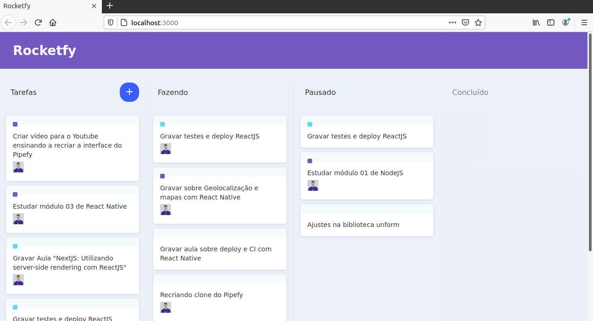

# RocketFy
> This is a Pipefy clone 

In this project Diego Fernandes built a Pipefy clone, but his solution luck some 
funcionalities. In his solution, is not possible to add task in empty list or add task in 
the end of list.

I built this solution based in his solution and i solved that isues.




## Instalation 

For instalation of all dependecies, go to cmd and run a code below

```sh
yarn install
```

After all dependecies installed

**To run**

```sh
yarn start 
```

## _Configuration_ (optional)


If you want to edit this project and upload it to your github page, you should do that

1. Go to package.json
2. Edit homepage 
3. Git init 
4. ... Other git commands to push in you repository 

**To build**

```sh
yarn build 
```

**To upload on your github page**

```sh
yarn deploy 
```


## Meta

Author - Diego Fernandes

programmer -  [Lutero Elavoco](https://www.linkedin.com/in/l%C3%BAtero-elavoco-5951b619b/) - luteroelavoco90@gmail.com


## Contributing 

1. Fork it (https://github.com/cientista1/rocketfy)
2. Create your feature branch (`git checkout -b feature/fooBar`)
3. Commit your changes (`git commit -am 'Add some fooBar'`)
4. Push to the branch (`git push origin feature/fooBar`)
5. Create a new Pull Request

